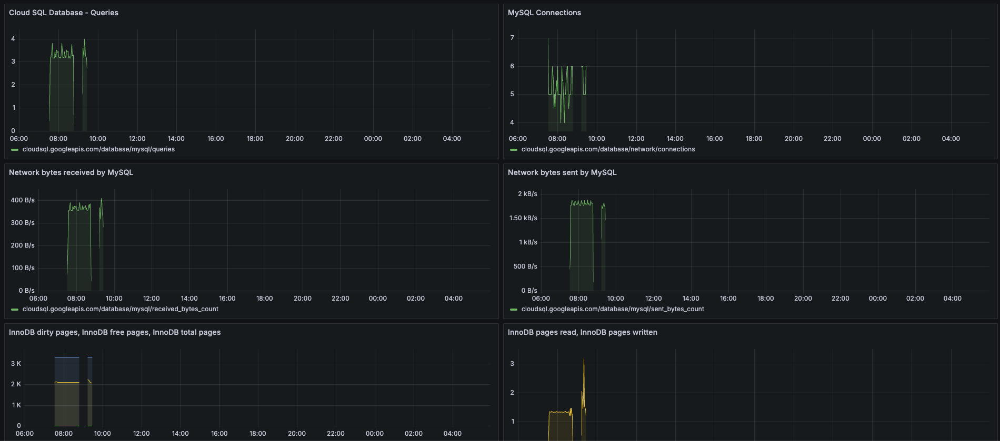

# MySQL

## Overview

We have installed 3 types of database: Cloud spanner / Cloud sql as managed service and mysqldb hosted on gke, in goal to show multiple database setup. 

For managed database setup, we can follow [ga-terraform](https://github.com/marwenbhriz/ga-terraform), and current repo for gke deployment.

## Initializing

```sh
# 1. Change to the directory
cd ./db/mysql/

# 2. Generate passwords
./do.sh create_new_passwords

# 3. Generate k8s secret
kubectl create secret generic secret-mysql --from-file=secrets -oyaml

# 4. Deploy
kubectl apply -f cm-mysql.yaml,mysql.yaml,svc-mysql.yaml
```

## Need Work
### Security
For best practice we need to access to db in two way: 
1. GKE: access to database with svc url. we cannot make our database as public.
2. Cloud sql: create the sql db with private access in the same vpc and access to db with private ip.

### Monitoring
1. GKE: setup exporter and add to prometheus and create dashboard to monitor the status of db.
2. Cloud sql: 

