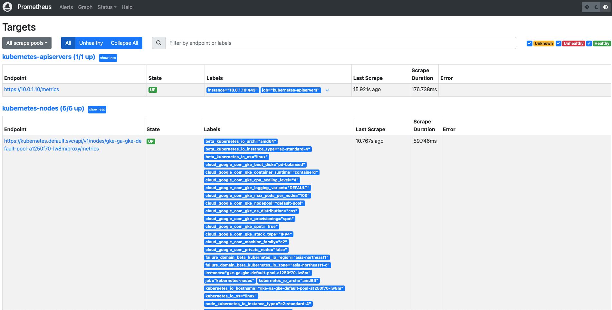

# prometheus

## Setup
```sh
helm search hub Prometheus
helm repo add prometheus-community https://prometheus-community.github.io/helm-charts

helm repo update

helm install prometheus prometheus-community/prometheus -n monitoring
```

or we can use the script.

```sh
./do.sh install_package package
```

## Need Work
after install exporters for any services, and we need to use as pull based system, we need to add new targets to scrape into prometheus.yaml and restart prometheus.


