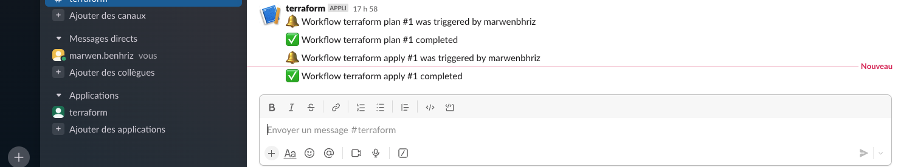

# Slack notification

We need to create terraform and deployment channels and apps and incoming webhook and add the post url to github secret for we can use in github actions workflow for ga-terraform --> terraform channel and ga-backend, ga-frontend --> deployment channel, for we can get a notification if there is anything failed and deployment of infra or apps done.  

