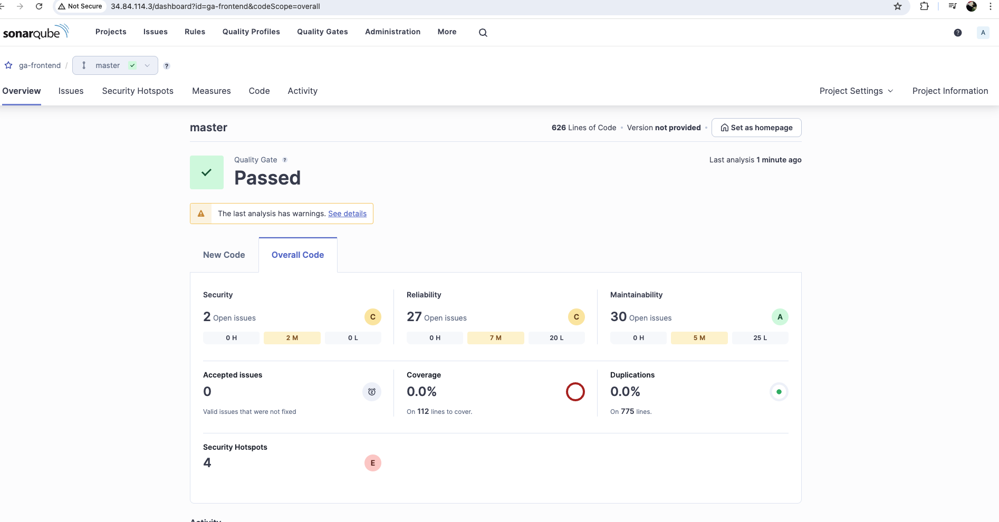
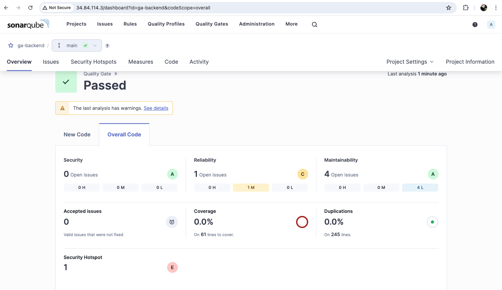
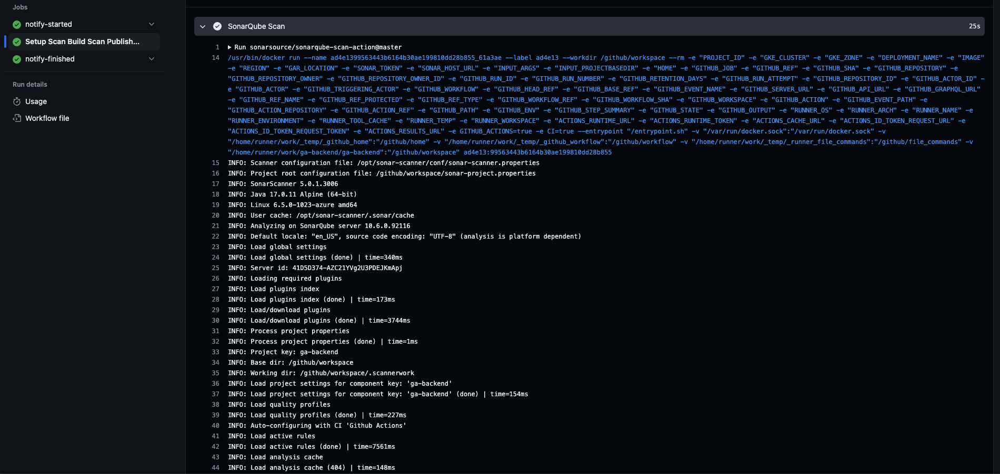

# SonarQube

## Overview
we can integrate sonarqube in our cicd workflow to deliver code that meets the highes quality standard.

## Initializing

```sh
kubectl apply -f namespace.yaml

helm install sonarqube oci://registry-1.docker.io/bitnamicharts/sonarqube -n sonarqube
```
we can find the password for use inside a secret and decode it.
Access to sonaqube server ui.
we need to create two project: ga-backend and ga-frontend and copy url and token into github secrets to use in cicd workflow.





we can check the scan report on every pull request merged to master branch and github actions workflow start.